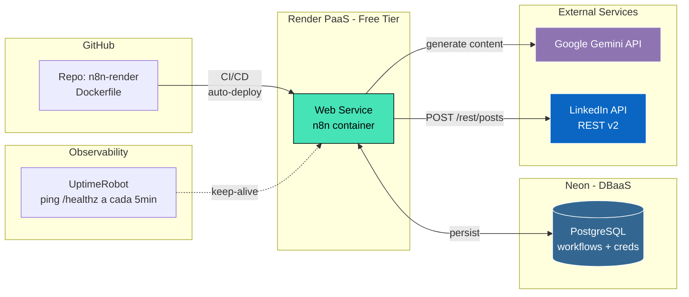
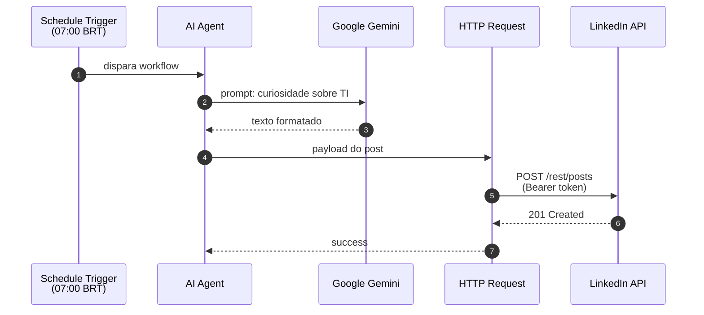

# 🤖 LinkedIn AI Auto-Post — n8n on Render

> Sistema autônomo de geração e publicação de conteúdo no LinkedIn, com agente de IA executando diariamente em produção. | Autonomous content generation and LinkedIn publishing system, with an AI agent running daily in production.

[](https://n8n.io/)
[](https://www.docker.com/)
[](https://render.com/)
[](https://neon.tech/)
[](https://ai.google.dev/)

---

## 🇧🇷 Português

### 📌 Visão geral

Workflow autônomo desenvolvido em **n8n** que, todos os dias às 07:00 (America/Sao_Paulo), realiza o seguinte fluxo:

1. **Schedule Trigger** dispara o workflow no horário configurado.
2. **AI Agent** orquestra a chamada ao modelo `Google Gemini` solicitando uma curiosidade sobre TI.
3. O conteúdo gerado é formatado para o padrão de post do LinkedIn.
4. **HTTP Request** publica o post diretamente via API REST do LinkedIn (`POST /rest/posts`).

A aplicação é **containerizada** via Docker, hospedada em PaaS (**Render** free tier), com persistência em **PostgreSQL gerenciado** (Neon) e monitoramento de uptime para evitar cold starts.

### 🏗️ Arquitetura



### 🔁 Fluxo de execução



### 🛠️ Stack técnica

| Camada              | Tecnologia                       | Função                                                 |
| ------------------- | -------------------------------- | ------------------------------------------------------ |
| Orquestração        | n8n (`n8nio/n8n:latest`)         | Engine de workflow e execução agendada                 |
| Conteinerização     | Docker                           | Empacotamento da imagem e portabilidade                |
| Hospedagem          | Render (Free Web Service)        | PaaS com auto-deploy via GitHub                        |
| Banco de dados      | Neon (Postgres 16 serverless)    | Persistência de workflows, credentials e execuções     |
| Modelo de linguagem | Google Gemini (via API)          | Geração de conteúdo natural                            |
| Integração externa  | LinkedIn REST API (Bearer Token) | Publicação programática no feed                        |
| CI/CD               | GitHub → Render webhooks         | Deploy automático a cada push na `main`                |
| Observabilidade     | UptimeRobot                      | Health-check a cada 5min para evitar spin-down do free tier |
| Roteamento HTTPS    | Render edge proxy + Let's Encrypt | TLS automático no domínio `*.onrender.com`             |

### 📂 Conteúdo do repositório

```
n8n-render/
├── Dockerfile          # Imagem oficial do n8n com timezone configurado
└── README.md           # Este arquivo
```

#### `Dockerfile`

```dockerfile
FROM n8nio/n8n:latest

ENV TZ=America/Sao_Paulo
ENV GENERIC_TIMEZONE=America/Sao_Paulo

EXPOSE 5678
```

A imagem oficial do n8n é estendida apenas para fixar o timezone — crítico para o `Schedule Trigger` disparar no horário correto.

### 🔐 Variáveis de ambiente

Configuradas no painel do Render. Variáveis sensíveis (senhas, chaves) **nunca** são commitadas no repositório.

| Variável                              | Descrição                                                                |
| ------------------------------------- | ------------------------------------------------------------------------ |
| `DB_TYPE`                             | `postgresdb` — força o uso de Postgres em vez do SQLite default          |
| `DB_POSTGRESDB_HOST`                  | Endpoint do Neon                                                         |
| `DB_POSTGRESDB_PORT`                  | `5432`                                                                   |
| `DB_POSTGRESDB_DATABASE`              | Nome do banco                                                            |
| `DB_POSTGRESDB_USER`                  | Usuário do Postgres                                                      |
| `DB_POSTGRESDB_PASSWORD`              | Senha (secret)                                                           |
| `DB_POSTGRESDB_SSL_REJECT_UNAUTHORIZED` | `false` — necessário pelo Neon usar cert wildcard                       |
| `N8N_HOST`                            | Domínio público fornecido pelo Render                                    |
| `N8N_PROTOCOL`                        | `https`                                                                  |
| `WEBHOOK_URL`                         | URL pública completa (usada por OAuth callbacks)                         |
| `N8N_ENCRYPTION_KEY`                  | Chave de 64 chars que cifra credenciais armazenadas (secret, imutável)   |
| `GENERIC_TIMEZONE` / `TZ`             | `America/Sao_Paulo`                                                      |
| `N8N_RUNNERS_ENABLED`                 | `false` — desabilitado para reduzir uso de RAM no free tier (512MB)      |
| `N8N_SECURE_COOKIE`                   | `false` — Render injeta TLS na borda; n8n vê HTTP internamente           |

### 🚀 Deploy

O deploy é totalmente automatizado:

1. Push na branch `main` → Render detecta via webhook do GitHub.
2. Render builda a imagem Docker.
3. Render reinicia o container com a nova imagem.
4. n8n inicializa, conecta ao Postgres do Neon e expõe o editor em `https://<service>.onrender.com`.

Para rebuild manual, basta clicar em **Manual Deploy → Deploy latest commit** no painel do Render.

### ⚠️ Decisões e trade-offs

- **Por que Render free + Neon free + UptimeRobot?**
  Combinação que entrega 24/7 a custo zero. Render free dorme após 15min sem tráfego — o UptimeRobot resolve via ping a cada 5min em `/healthz`.

- **Por que Postgres externo (Neon) e não SQLite?**
  Filesystem do Render free é **efêmero** — perde dados a cada redeploy. O Neon garante persistência de workflows e credenciais.

- **Por que `N8N_RUNNERS_ENABLED=false`?**
  Free tier tem apenas 512MB RAM. Task runners são processos separados que consomem memória. Para um workflow simples, executar no processo principal é suficiente.

- **Por que HTTP Request direto em vez do nó nativo do LinkedIn?**
  Maior controle sobre o payload e dispensa configuração de OAuth dentro do n8n para esse caso específico (uso de Bearer Token de longa duração).

### 🩺 Observabilidade e manutenção

- **UptimeRobot**: monitor HTTP em `https://<service>.onrender.com/healthz`, intervalo de 5 minutos.
- **Render Metrics**: dashboard nativo mostra CPU, memória, requisições e horas consumidas (limite mensal de 750h no free tier).
- **n8n Executions**: aba interna do n8n com histórico de execuções, payloads e erros por nó.
- **Backup**: workflows exportados manualmente em JSON via `Workflows → ⋯ → Download` (semanal recomendado).

### 🐛 Troubleshooting

| Sintoma                                     | Causa provável                                  | Resolução                                         |
| ------------------------------------------- | ----------------------------------------------- | ------------------------------------------------- |
| `502 Bad Gateway` no primeiro acesso        | Container ainda subindo / OOM                   | Aguardar 60s; conferir Render logs                |
| `Cannot connect to database`                | Neon offline ou env var incorreta               | Validar connection string + `SSL_REJECT...=false` |
| Workflow não dispara no horário             | Timezone errado                                 | Conferir `TZ=America/Sao_Paulo` em env vars       |
| Credenciais "quebradas" após redeploy       | `N8N_ENCRYPTION_KEY` alterada                   | Manter a chave fixa; nunca regenerar              |
| Free tier suspenso                          | Excedeu 750h/mês                                | Pausar UptimeRobot algumas horas/dia              |

### 📈 Possíveis evoluções

- [ ] Integração de geração de imagem (Imagen/DALL-E) anexada ao post.
- [ ] Notificação via Telegram/Email em caso de execução com falha.
- [ ] Anti-repetição de temas via consulta ao Postgres.
- [ ] Tracking de engajamento (likes/comentários) após N horas do post.
- [ ] Replicação multi-plataforma (X/Twitter, Threads).
- [ ] Migração do Bearer Token estático para fluxo OAuth2 com refresh automático.

---

## 🇺🇸 English

### 📌 Overview

Autonomous workflow built with **n8n** that, every day at 07:00 (America/Sao_Paulo), executes the following pipeline:

1. **Schedule Trigger** fires the workflow at the configured time.
2. **AI Agent** orchestrates a call to the `Google Gemini` model, requesting an IT-related fact.
3. The generated content is formatted to fit the LinkedIn post layout.
4. **HTTP Request** publishes the post directly via the LinkedIn REST API (`POST /rest/posts`).

The application is **containerized** via Docker, hosted on a PaaS (**Render** free tier), with persistence in a **managed PostgreSQL** (Neon), and uptime monitoring to mitigate cold starts.

### 🏗️ Architecture

See the Mermaid diagram in the Portuguese section above — it renders the same regardless of language.

### 🛠️ Tech stack

| Layer               | Technology                       | Role                                                          |
| ------------------- | -------------------------------- | ------------------------------------------------------------- |
| Orchestration       | n8n (`n8nio/n8n:latest`)         | Workflow engine and scheduled execution                       |
| Containerization    | Docker                           | Image packaging and portability                               |
| Hosting             | Render (Free Web Service)        | PaaS with auto-deploy via GitHub                              |
| Database            | Neon (Postgres 16 serverless)    | Persistence of workflows, credentials, and executions         |
| Language model      | Google Gemini (via API)          | Natural-language content generation                           |
| External integration| LinkedIn REST API (Bearer Token) | Programmatic feed publishing                                  |
| CI/CD               | GitHub → Render webhooks         | Auto-deploy on every push to `main`                           |
| Observability       | UptimeRobot                      | 5-minute health checks to prevent free-tier spin-down         |
| HTTPS routing       | Render edge proxy + Let's Encrypt| Automatic TLS on `*.onrender.com`                             |

### 🔐 Environment variables

Configured in Render's dashboard. Sensitive variables (secrets, keys) are **never** committed to the repository.

Key variables:

- `DB_TYPE=postgresdb` and full Neon connection params (forces Postgres over default SQLite).
- `N8N_ENCRYPTION_KEY`: 64-char secret that encrypts stored credentials (must remain immutable).
- `TZ=America/Sao_Paulo`: critical for the schedule trigger.
- `N8N_RUNNERS_ENABLED=false`: disabled to reduce RAM consumption on the 512MB free tier.
- `N8N_SECURE_COOKIE=false`: Render injects TLS at the edge; n8n sees plain HTTP internally.

### 🚀 Deployment

Fully automated:

1. Push to `main` → Render is notified via GitHub webhook.
2. Render builds the Docker image.
3. Render restarts the container with the new image.
4. n8n boots, connects to the Neon Postgres, and exposes the editor at `https://<service>.onrender.com`.

Manual rebuild: **Manual Deploy → Deploy latest commit** in the Render dashboard.

### ⚠️ Design decisions and trade-offs

- **Why Render free + Neon free + UptimeRobot?**
  Combination that delivers 24/7 uptime at zero cost. Render free spins down after 15min of inactivity — UptimeRobot solves it by pinging `/healthz` every 5 minutes.

- **Why an external Postgres (Neon) instead of SQLite?**
  Render free's filesystem is **ephemeral** — data is lost on every redeploy. Neon ensures workflow and credential persistence.

- **Why `N8N_RUNNERS_ENABLED=false`?**
  Free tier has only 512MB RAM. Task runners are separate processes that consume memory. For a simple workflow, running in the main process is sufficient.

- **Why a raw HTTP Request instead of the native LinkedIn node?**
  Greater payload control and avoids OAuth setup inside n8n for this specific case (long-lived Bearer Token usage).

### 🩺 Observability and maintenance

- **UptimeRobot**: HTTP monitor on `https://<service>.onrender.com/healthz`, 5-minute interval.
- **Render Metrics**: built-in dashboard showing CPU, memory, requests, and consumed hours (free tier monthly cap: 750h).
- **n8n Executions**: in-app tab with execution history, payloads, and per-node errors.
- **Backup**: weekly manual JSON export via `Workflows → ⋯ → Download`.

### 🐛 Troubleshooting

| Symptom                                       | Likely cause                              | Resolution                                          |
| --------------------------------------------- | ----------------------------------------- | --------------------------------------------------- |
| `502 Bad Gateway` on first access             | Container booting / OOM                   | Wait 60s; check Render logs                         |
| `Cannot connect to database`                  | Neon offline or wrong env var             | Validate connection string + `SSL_REJECT...=false`  |
| Workflow doesn't fire at scheduled time       | Wrong timezone                            | Check `TZ=America/Sao_Paulo` in env vars            |
| Credentials "broken" after redeploy           | `N8N_ENCRYPTION_KEY` was changed          | Keep the key fixed; never regenerate                |
| Free tier suspended                           | Exceeded 750h/month                       | Pause UptimeRobot a few hours/day                   |

### 📈 Future improvements

- [ ] Image generation (Imagen/DALL-E) attached to the post.
- [ ] Telegram/Email notifications on failed executions.
- [ ] Topic anti-repetition via Postgres lookup.
- [ ] Engagement tracking (likes/comments) after N hours.
- [ ] Multi-platform replication (X/Twitter, Threads).
- [ ] Migrate from static Bearer Token to OAuth2 with auto-refresh.

---

## 👤 Author

**Heitor Cabral** — Software Engineering student @ UFG · Backend / AI / IoT enthusiast
🔗 [LinkedIn](https://www.linkedin.com/in/heitor-cabral) · 💻 [GitHub](https://github.com/heitorcavss)

---

## 📄 License

MIT — feel free to fork, learn, and adapt.
